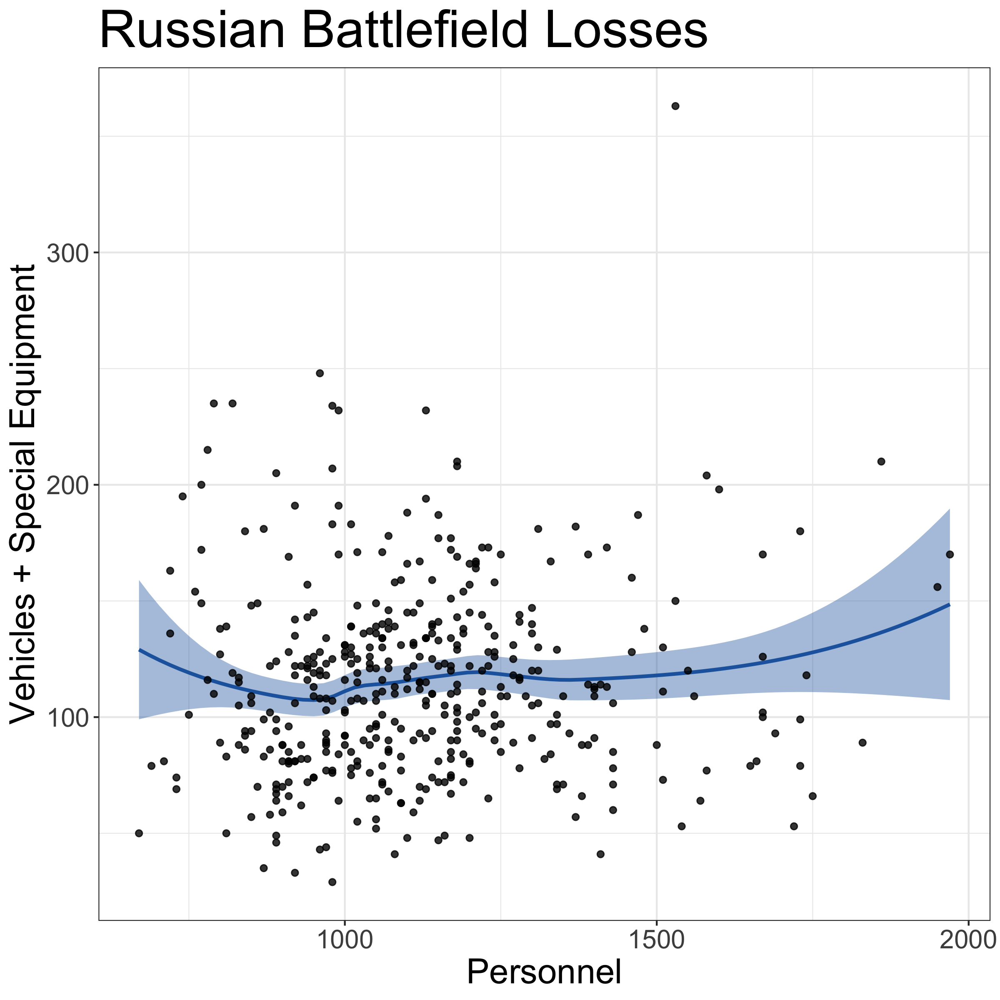
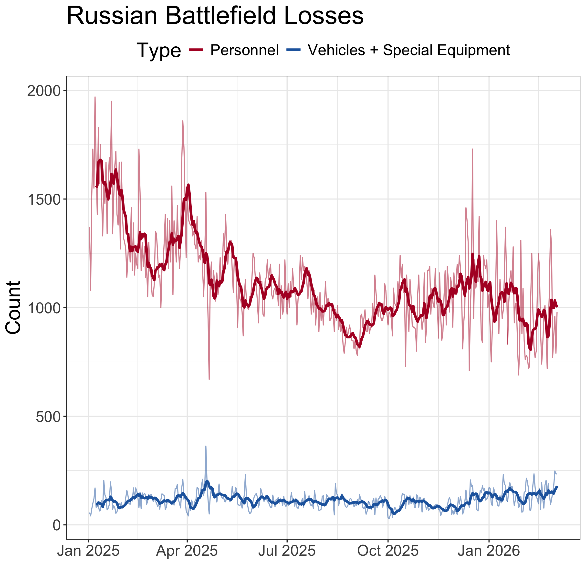

A Brief Exploratory Analysis of Reported Russian Casualties and Vehicle
Losses
================
greeny-blue
2026-03-05

# Introduction

Open-source datasets tracking battlefield losses in the Russia–Ukraine
war have enabled independent analysts to explore patterns in reported
attrition.

One hypothesis occasionally raised in commentary is that Russian
personnel casualties and losses of vehicles or “special equipment” might
exhibit a negative relationship. The reasoning is that if attacks focus
more heavily on personnel on a given day, fewer vehicles might be
destroyed, and vice versa. The idea has been discussed in public
commentary by Professor Darin Gerdes in his analysis of the war. This
brief exploratory analysis examines whether such a relationship is
visible in the reported daily loss data.

Professor Gerdes discusses this hypothesis in commentary on his YouTube
channel, [Professor Gerdes
Explains](https://www.youtube.com/@Professor-Gerdes).

# Data

This analysis uses daily loss estimates compiled by Ragnar Gudmundsson
and presented through the publicly available [dashboard of reported
Russian battlefield
losses](https://lookerstudio.google.com/reporting/dfbcec47-7b01-400e-ab21-de8eb98c8f3a/page/p_70wiatllvd?s=up65eAX-um4).
The variables used in this analysis are:

- **Casualties**: reported personnel losses.
- **Vehicles + Special Equipment**: reported losses of vehicles and
  equipment categories grouped together in the dataset.

The analysis focuses on data from **2025 onward**, as this was the
period during which Professor Gerdes began noting a potential pattern in
daily losses. The data are available to download from the interactive
plots in Ragnar Gudmundsson’s dashboard, which provides access to
multiple temporal resolutions. To test the hypothesis of a day-to-day
negative correlation between casualties and vehicle or equipment losses,
all data were collected at the **daily resolution**.

# Method

The hypothesis was examined using simple exploratory visualisation:

1.  **Scatter plot analysis** of casualties versus vehicle and equipment
    losses to assess the presence of any negative relationship.
2.  **LOESS smoothing** to reveal the underlying trend in the scatter
    plot.
3.  **Time-series visualisation** of daily losses with a rolling mean to
    highlight broader patterns and variability.

These methods aim to provide a descriptive view of the relationship
without imposing strong modelling assumptions.

# Results

``` r
knitr::opts_chunk$set(
  echo = TRUE,
  warning = FALSE,
  message = FALSE
)
```

``` r
# loading dependencies
library(tidyverse)
library(ggplot2)
library(slider)
library(lubridate)

# loading data (all acquired from Radnar Gudmundsson's dashboard)
casualties <- read.csv("data/Russian casualties.csv")
vehicles <- read.csv("data/Vehicles.csv")
special_equipment <- read.csv("data/Special equipment.csv")

# joining data and creating date column
dbd <- casualties %>% 
  left_join(vehicles, by = "Day") %>%
  left_join(special_equipment, by = c("Day" = "Date")) %>%
  mutate(Date = dmy(Day))

# tidying up data and summing vehicles and special equipment as "Vehicles_Special" column
dbd <- dbd %>% select(-c(Combat.engagements, Vehicles..7.day.average., Special.equipment..7.day.average., Day))
names(dbd) <- c("Casualties", "Vehicles", "Special", "Date")
dbd <- dbd %>% mutate (`Vehicles_Special` = Vehicles + `Special`)
```

The `ANALYSIS_FROM_DATE` object below can be altered to assess a
different start date:

``` r
# change date below to analyse data from a different start date
# the complete dataset contains some missing values
ANALYSIS_FROM_DATE <- "2025-01-01"

# filtering data to start on 1st Jan 2025
analysis_data <- dbd %>%
  filter(Date > as.Date(ANALYSIS_FROM_DATE))

# day the data were downloaded and which the data extends to
max(analysis_data$Date)
```

    ## [1] "2026-03-04"

## Scatter Plot of Casualties vs Vehicle and Equipment Losses

``` r
# scatter plot of raw data
analysis_data %>%
  ggplot(aes(Casualties, Vehicles_Special)) +
  geom_smooth(method = "loess", col = "#2166AC", fill = "#2166AC") +
  geom_point(alpha = 0.8) +
  theme_bw() +
  theme(axis.title = element_text(size = 20),
        axis.text = element_text(size = 15),
        title = element_text(size = 25)) +
  labs(title = "Russian Battlefield Losses",
       x = "Personnel",
       y = "Vehicles + Special Equipment")
```

<!-- -->

The scatter plot does not reveal a clear negative relationship between
reported casualties and vehicle or equipment lossesInstead, the
relationship appears weak and approximately flat across most of the
observed range.

A LOESS smoothing curve similarly shows no consistent downward trend
(sloping line from top left to bottom right) that would indicate a
trade-off between the two categories of loss.

## Time Series of Reported Losses

``` r
# time series of personnel and vehicle + special equipment losses
analysis_data %>%
  tidyr::pivot_longer(
    cols = c(Casualties, Vehicles_Special),
    names_to = "Type",
    values_to = "Count"
  ) %>%
  arrange(Type, Date) %>%
  group_by(Type) %>%
  mutate(
    rolling_mean = slider::slide_dbl(Count, mean, .before = 6, .complete = TRUE)
  ) %>%
  ggplot(aes(Date, Count, col = Type)) +
  geom_line(alpha = 0.5) +
  geom_line(aes(y = rolling_mean), linewidth = 1.2) +
  scale_color_manual(
    name = "Type",
    values = c(
      "Casualties" = "#B2182B",
      "Vehicles_Special"   = "#2166AC"
    ),
    labels = c(
      "Casualties" = "Personnel",
      "Vehicles_Special"   = "Vehicles + Special Equipment"
    )
  ) +
  theme_bw() +
  theme(
    axis.title = element_text(size = 20),
    axis.text = element_text(size = 15),
    plot.title = element_text(size = 25),
    legend.title = element_text(size = 20),
    legend.text = element_text(size = 15),
    legend.position = "top"
  ) +
  labs(
    title = "Russian Battlefield Losses",
    y = "Count",
    x = ""
  )
```

<!-- -->

The time-series visualisation highlights a notable difference in
variability between the two categories. Personnel casualties fluctuate
widely across days, while vehicle and equipment losses remain within a
comparatively narrow band.

The rolling mean reinforces this pattern, suggesting that vehicle losses
are relatively stable over time compared with the more volatile casualty
counts.

## Additional Statistical Checks

Two simple statistical checks were used to complement the visual
analysis.  

First, a Spearman rank correlation was calculated to assess the
monotonic association between casualties and vehicle losses. If the
hypothesis is correct the coefficient should be a negative value, and a
stronger correlation closer to (negative) one than zero.

``` r
# correlation (spearman's)
cor.test(analysis_data$Casualties,
    analysis_data$Vehicles_Special,
    method = "spearman")
```

    ## 
    ##  Spearman's rank correlation rho
    ## 
    ## data:  analysis_data$Casualties and analysis_data$Vehicles_Special
    ## S = 11988949, p-value = 0.1166
    ## alternative hypothesis: true rho is not equal to 0
    ## sample estimates:
    ##        rho 
    ## 0.07604433

Second, observations were divided into high and low groups using the
median for each variable. If above average (high) vehicle (and special
equipment) losses occurred when casualties were low, or vice versa, then
high/low and low/high counts should be significantly larger than
high/high and low/low.

The contigency table was then tested using a chi-square test of
independence to assess whether the observed distribution differed from
what would be expected if the variables were unrelated.

``` r
# counts of above and below average losses for personnel and vehicles + special equipment
analysis_data %>%
  mutate(
    Cas_level = ifelse(Casualties > median(Casualties), "High", "Low"),
    Veh_level = ifelse(Vehicles_Special > median(Vehicles_Special), "High", "Low")
  ) %>%
  count(Cas_level, Veh_level)
```

    ##   Cas_level Veh_level   n
    ## 1      High      High 110
    ## 2      High       Low  98
    ## 3       Low      High 100
    ## 4       Low       Low 119

``` r
# chi-squared test
analysis_data %>%
  mutate(
    Cas_level = Casualties > median(Casualties),
    Veh_level = Vehicles_Special > median(Vehicles_Special)
  ) %>%
  with(chisq.test(table(Cas_level, Veh_level)))
```

    ## 
    ##  Pearson's Chi-squared test with Yates' continuity correction
    ## 
    ## data:  table(Cas_level, Veh_level)
    ## X-squared = 1.947, df = 1, p-value = 0.1629

Both checks produced results consistent with the visual analysis. A
negative correlation did not present in these data. High/low and
low/high counts were not significantly larger than their
like-combination counterparts in the contingency table. The chi-square
test of independence did not indicate a statistically meaningful
association between the two variables (where the p-value would normally
be expected to be $< 0.05$).

# Interpretation

Several observations can be drawn from these visualisations:

- There is **no clear evidence of a negative relationship** between
  casualties and vehicle losses in the data examined.
- **Personnel losses exhibit much greater variability** than vehicle
  losses across days.
- Vehicle losses appear to remain within a **relatively constrained
  range**, even when casualties increase substantially.

These patterns suggest that personnel losses may scale more strongly
with battlefield intensity than vehicle losses.

However, the scatter plot alone does not allow causal conclusions to be
drawn. Several factors may influence the observed patterns, including
operational tempo, tactical conditions, reporting practices, and the
availability or exposure of vehicles on the battlefield.

# Limitations

This analysis relies on **reported daily loss estimates**, which may
contain measurement uncertainty or reporting biases. Additionally, the
variables used here do not directly measure battle intensity or tactical
circumstances, both of which could influence the relationship between
personnel and vehicle losses.

As a result, the analysis should be interpreted as **descriptive rather
than causal**.

# Conclusion

The exploratory analysis does not support the hypothesis that Russian
casualties and vehicle losses exhibit a strong negative relationship.
Instead, the data suggest that personnel losses fluctuate widely across
days while vehicle losses remain comparatively stable.

This pattern may indicate that personnel losses scale more strongly with
overall battle intensity than vehicle losses, though further analysis
would be required to examine the underlying mechanisms.

# Reproducibility

All analysis was conducted in **R** (version 4.5.2, “\[Not\] Part in a
Rumble”) using the R Markdown framework to ensure the workflow is fully
reproducible. Data preparation, transformation, and visualisation were
implemented using widely used open-source packages, including:

- **dplyr** and **tidyr** (data manipulation and reshaping) from the
  **tidyverse** package
- **lubridate** (date conversion)
- **ggplot2** (visualisation)
- **slider** (rolling mean calculations)

The analysis relies exclusively on publicly available data from [Ragnar
Gudmundsson’s dashboard of reported Russian battlefield
losses](https://lookerstudio.google.com/reporting/dfbcec47-7b01-400e-ab21-de8eb98c8f3a/page/p_70wiatllvd?s=up65eAX-um4).
Code used to generate the figures can be executed directly within this
document to reproduce the results.

**Note: Some of this analysis was referenced by Professor Gerdes in his
discussion of daily Ukrainian gains and Russian losses (5th March 2026).
The segment discussing these plots can be viewed here: [Ukraine Sets
Drone Strike Record Overnight - Russia Hit
Hard](https://www.youtube.com/watch?v=fSv_dt_FMws&t=510s).**
