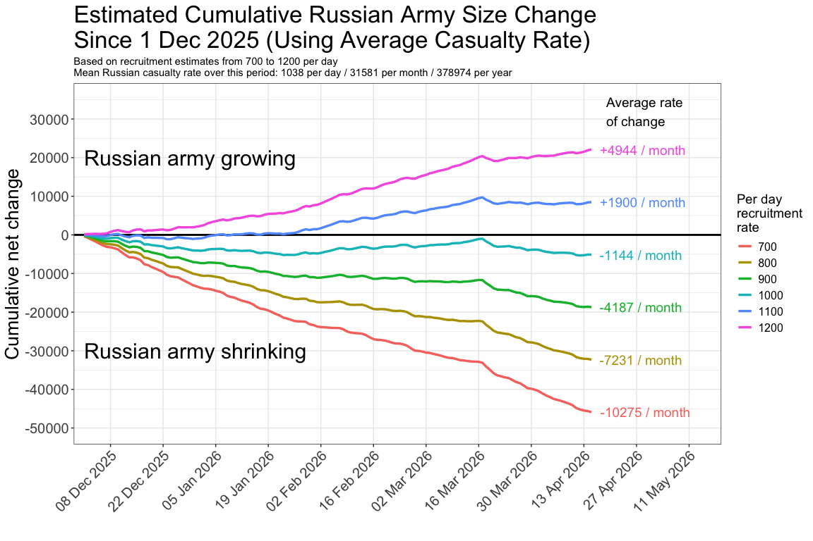

Russian Army Size Projections Based on Recruitment Scenarios
================
greeny-blue
2026-04-16

## Context

I came across a recent claim that Russian recruitment rates may now be
as low as 800 per day. In a video published on 15 April, [Jason Jay
Smart](https://www.youtube.com/@JasonJaySmart) suggests this figure at
approximately the 4-minute mark.

- Video: [Russia Is COLLAPSING
  Fast](https://www.youtube.com/watch?v=vQzsLM6bjCs)
- Timestamped link: <https://www.youtube.com/watch?v=vQzsLM6bjCs&t=230>

------------------------------------------------------------------------

## Brief Summary

At current casualty rates (~1,038/day since 1 Dec 2025), Russia needs
roughly that level of recruitment to maintain force size. If recruitment
has fallen toward ~800/day, the army may be shrinking by ~7,000+
personnel per month, with relatively small changes in recruitment
producing large cumulative effects over time.

------------------------------------------------------------------------

## Data

This analysis uses daily loss estimates compiled by Ragnar Gudmundsson
and presented through the publicly available [dashboard of reported
Russian battlefield
losses](https://lookerstudio.google.com/reporting/dfbcec47-7b01-400e-ab21-de8eb98c8f3a/page/p_70wiatllvd?s=up65eAX-um4).

------------------------------------------------------------------------

## Code and Plot

``` r
library(dplyr)
library(tidyr)
library(ggplot2)
library(lubridate)

since_date <- "2025-12-01"

casualties <- read.csv("data/Ukraine_Russian_casualties_Time_series_2026-04-16.csv")

recruitment_estimates <- seq(700, 1200, by = 100)

casualties <- casualties[-ncol(casualties)]
names(casualties)[2] <- "Casualties"
casualties$Casualties[is.na(casualties$Casualties)] <- 0

casualties_long <- casualties %>% 
  mutate(Date = lubridate::dmy(Day)) %>%
  select(Date, Casualties) %>%
  filter(Date >= as.Date(since_date)) %>%
  crossing(recruitment_estimate = recruitment_estimates) %>%
  arrange(recruitment_estimate, Date) %>%
  mutate(Daily_net_change = recruitment_estimate - Casualties) %>%
  group_by(recruitment_estimate) %>%
  mutate(Cumulative = cumsum(Daily_net_change)) %>%
  ungroup()

cas_mean <- mean(casualties_long$Casualties)
cas_mean_annually <- 365.25 * mean(casualties_long$Casualties)
cas_mean_monthly <- cas_mean_annually / 12

n_days <- n_distinct(casualties_long$Date)

# label_data <- casualties_long %>% 
#   filter(Date == max(Date)) %>%
#   mutate(
#     mean_net = round(Cumulative / n_days, 0),
#     label = sprintf("%+d / day", mean_net)
#   )

label_data <- casualties_long %>% 
  filter(Date == max(Date)) %>%
  mutate(
    mean_net = round((Cumulative / n_days) * 365.25 / 12, 0),
    label = sprintf("%+d / month", mean_net)
  )

ggplot(casualties_long, aes(Date, Cumulative, colour = factor(recruitment_estimate))) +
  geom_hline(yintercept = 0, linewidth = 1) +
  geom_line(linewidth = 1.2) +
  geom_text(
    data = label_data,
    aes(Date, Cumulative, label = label, colour = factor(recruitment_estimate)),
    hjust = -0.1,
    size = 5,
    show.legend = FALSE
  ) +
  scale_x_date(
    date_breaks = "2 weeks",
    date_labels = "%d %b %Y",
    expand = expansion(mult = c(0.02, 0.22))
  ) +
  theme_bw() +
  theme(
    axis.text.x = element_text(angle = 45, hjust = 1),
    axis.title = element_text(size = 20),
    axis.text = element_text(size = 15),
    plot.title = element_text(size = 25),
    legend.title = element_text(size = 14),
    legend.text = element_text(size = 12),
    panel.grid.minor.x = element_blank()
  ) +
  labs(
    title = "Estimated Cumulative Russian Army Size Change\nSince 1 Dec 2025 (Using Average Casualty Rate)",
    subtitle = paste0(
      "Based on recruitment estimates from 700 to 1200 per day\nMean Russian casualty rate over this period: ",
      round(cas_mean, 0), " per day / ",
      round(cas_mean_monthly, 0), " per month / ",
      round(cas_mean_annually, 0), " per year"
    ),
    x = "",
    y = "Cumulative net change",
    colour = "Per day\nrecruitment\nrate"
  ) +
  scale_y_continuous(
    limits = c(-50000, 35000),
    breaks = seq(-50000, 35000, 10000)
  ) +
  geom_text(
    data = data.frame(Date = as.Date("2025-12-01"), Cumulative = -30000),
    aes(Date, Cumulative, label = "Russian army shrinking"),
    inherit.aes = FALSE,
    hjust = 0,
    size = 8
  ) +
  geom_text(
    data = data.frame(Date = as.Date("2025-12-01"), Cumulative = 20000),
    aes(Date, Cumulative, label = "Russian army growing"),
    inherit.aes = FALSE,
    hjust = 0,
    size = 8
  ) +
  geom_text(
    data = data.frame(Date = as.Date(max(casualties_long$Date) + 4), Cumulative = 32000),
    aes(Date, Cumulative, label = "Average rate\nof change"),
    inherit.aes = FALSE,
    hjust = 0,
    size = 5
  )
```

<!-- -->

------------------------------------------------------------------------

## Interpretation

This plot illustrates how the size of the Russian army would have
evolved since 1 December 2025 under different assumptions about daily
recruitment, given an average casualty rate of approximately 1,038
personnel per day over the same period. The zero line effectively
represents this replacement threshold: if recruitment matches
casualties, the cumulative net change remains flat; if recruitment falls
below this level, the force declines; and if it exceeds it, the force
grows.

Under lower recruitment scenarios, the projections indicate a sustained
contraction in force size. At 800 recruits per day — as recently
suggested — the army would be shrinking by roughly 7,200 personnel per
month. Even at 900 per day, losses would still exceed recruitment by
over 4,000 per month, while a rate of 1,000 per day would result in a
more gradual decline of around 1,100 per month. These trajectories imply
that, if current casualty rates are accurate and recruitment has indeed
fallen to around 800 per day, the Russian army is likely experiencing a
meaningful net reduction in size over time.

By contrast, recruitment at or above the widely cited target of around
1,120 per day would place the system near equilibrium or slight growth.
At 1,100 recruits per day, the army would expand modestly by roughly
1,900 personnel per month, though at the casualty rates since mid-March
force size change would likely be negligible. At 1,200 per day the
increase would be closer to 5,000 per month. This highlights a narrow
tipping point: relatively small differences in recruitment rates — on
the order of 100 to 200 personnel per day — translate into substantial
cumulative gains or losses over the course of months.

Of course, recruitment is not constant and will fluctuate over time in
response to policy, incentives, and battlefield conditions. These
projections should therefore be interpreted as indicative rather than
predictive, offering a structured way to understand how different
recruitment levels interact with observed casualty rates. Within that
framework, the overall pattern suggested by the data is one in which
recruitment and battlefield effectiveness appear to be under increasing
strain, while Ukrainian capabilities are improving, shifting the balance
toward net attrition in several plausible scenarios.

------------------------------------------------------------------------
